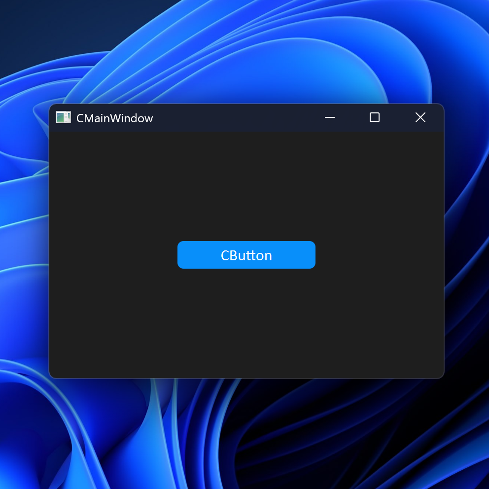

<h1 align="center">CustomPyQt</h1>

CustomPyQt is a python GUI interface library built from the PySide6
library, providing a modern and consitant interface with styled widgets
and dark and light themes; all widget's colors can be styled in 
("light", "dark") format. CustomPyQt can also be used or integrated 
with PySide and PyQt versions as long as PySide6 is installed.

## Installation
Install the module with pip:

```
pip install pyct
```

## Example Program
Here is a simple example program with only one button to test the CustomPyQt library:

```python
from PyCt import CMainWindow, CButton, set_appearance_mode, set_color_theme
from PySide6.QtWidgets import QApplication, QVBoxLayout
from PySide6.QtCore import Qt

set_appearance_mode("system")
set_color_theme("blue")

class MainWindow(CMainWindow):
    def __init__(self):
        super().__init__(width=400, height=250, title="CMainWindow", background_color="rgb(30,30,30)")

        self.main_layout = QVBoxLayout()
        self.main_layout.setAlignment(Qt.AlignmentFlag.AlignCenter)

        self.button = CButton(master=self, text="CButton", command=self.command)

        self.main_layout.addWidget(self.button)
        self.setLayout(self.main_layout)

    def command(self):
        print("Button Clicked!")

app = QApplication()
win = MainWindow()
win.show()
app.exec()
```

which results in this window on Windows 11



You can find more example programs in the [examples folder](https://github.com/Dliammc/CustomPyQt/tree/main/examples)


